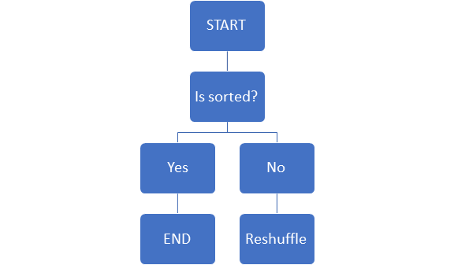
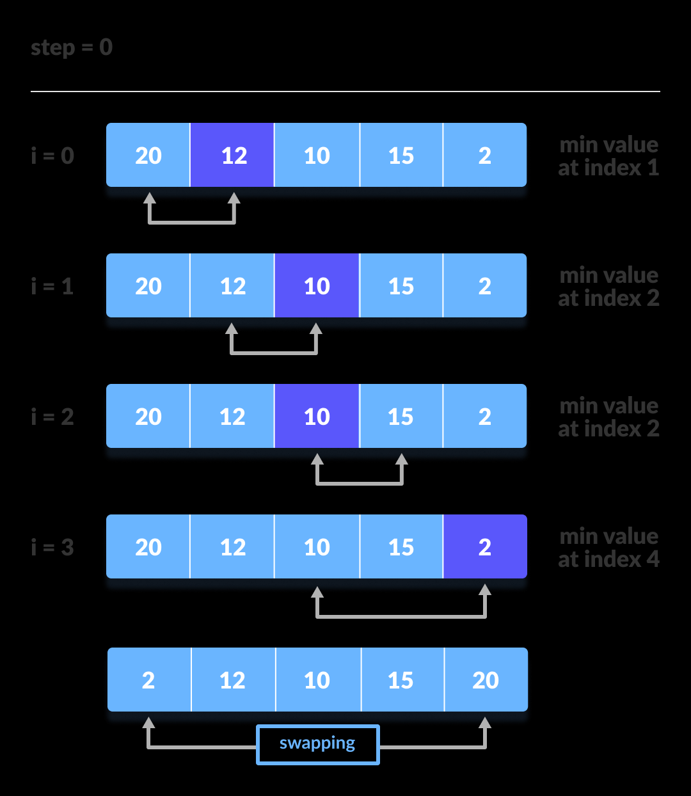
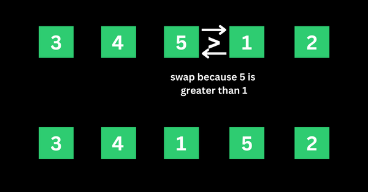

# Python Sorting Algorithms #
This repo includes sorting algorithms such as:
1. Bogo sort
2. Selection sort
3. Bubble sort

## Bogo Sort
Bogo sort is basically reshuffling the list until it's sorted. It's not an efficient algorithm to use (O((n+1)!)).

## Selection Sort
Finding the current minimum number of the list, adding it to the first index of unsorted list, and keep doing it until it's completely sorted. It can be done either swapping indexes or creating a new list. In *selection.py*, you can see an example of new list creating method

[*image source*](https://www.programiz.com/dsa/selection-sort)

## Bubble Sort:
This algorithm compares two adjacent elements and swaps them until they are in the intended order. In *bubble.py*, you can see an example of a sorting algorithm starting from the end of the list and keep towards the beginning.

[*image source*](https://www.freecodecamp.org/news/bubble-sort-algorithm-in-java-cpp-python-with-example-code/)